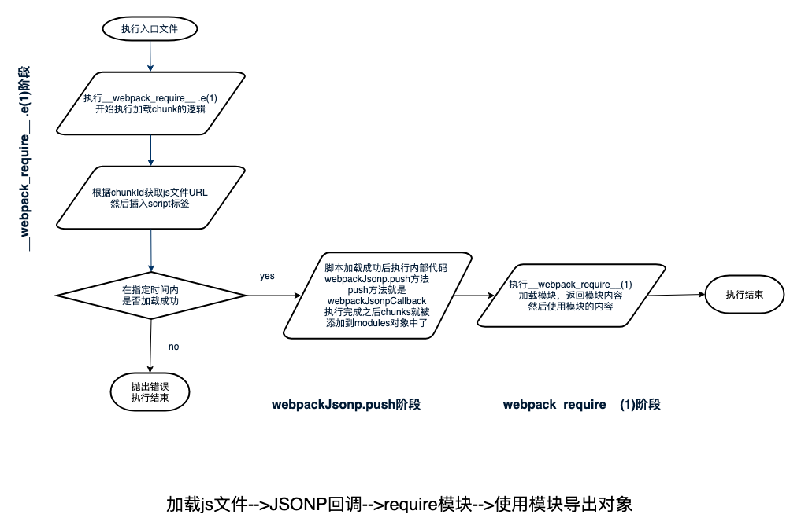

# webpack 原理-webpack 模板代码

## 目录

1. [webpack-demo](./webpack-demo/READMD.md)

## webpack 模板代码是什么

webpack 都打包项目后，我们可以看到在我们的业务代码外面被包裹在了一段代码里面，而这段代码就是 webpack 生成的 runtime 代码，这里我就简称为 webpack 模板代码了

## webpack 没有代码切割时生成文件

- 示例目录结构

```bash
.
├── README.md
├── dist # 打包生成文件
│   ├── 1.js # src/chunk.js => 1.js
│   ├── app.js # src/index.js => app.js
│   └── splitChunk.js # src/splitChunk.js => splitChunk.js
├── package.json
├── src
│   ├── chunk.js # 动态加载的chunk
│   ├── index.js # 非代码切割入口文件
│   └── splitChunk.js # 代码切割入口文件
├── webpack.config.js
└── yarn.lock
```

- index.js

```js
// index.js
console.log('app')
```

- build 之后的文件

```js
;(function(modules) {
  // webpackBootstrap
  // The module cache
  var installedModules = {}

  // The require function
  function __webpack_require__(moduleId) {
    // Check if module is in cache
    if (installedModules[moduleId]) {
      return installedModules[moduleId].exports
    }
    // Create a new module (and put it into the cache)
    var module = (installedModules[moduleId] = {
      i: moduleId,
      l: false,
      exports: {}
    })

    // Execute the module function
    modules[moduleId].call(module.exports, module, module.exports, __webpack_require__)

    // Flag the module as loaded
    module.l = true

    // Return the exports of the module
    return module.exports
  }

  // expose the modules object (__webpack_modules__)
  __webpack_require__.m = modules

  // expose the module cache
  __webpack_require__.c = installedModules

  // define getter function for harmony exports
  __webpack_require__.d = function(exports, name, getter) {
    if (!__webpack_require__.o(exports, name)) {
      Object.defineProperty(exports, name, { enumerable: true, get: getter })
    }
  }

  // define __esModule on exports
  __webpack_require__.r = function(exports) {
    if (typeof Symbol !== 'undefined' && Symbol.toStringTag) {
      Object.defineProperty(exports, Symbol.toStringTag, { value: 'Module' })
    }
    Object.defineProperty(exports, '__esModule', { value: true })
  }

  // create a fake namespace object
  // mode & 1: value is a module id, require it
  // mode & 2: merge all properties of value into the ns
  // mode & 4: return value when already ns object
  // mode & 8|1: behave like require
  __webpack_require__.t = function(value, mode) {
    if (mode & 1) value = __webpack_require__(value)
    if (mode & 8) return value
    if (mode & 4 && typeof value === 'object' && value && value.__esModule) return value
    var ns = Object.create(null)
    __webpack_require__.r(ns)
    Object.defineProperty(ns, 'default', { enumerable: true, value: value })
    if (mode & 2 && typeof value != 'string')
      for (var key in value)
        __webpack_require__.d(
          ns,
          key,
          function(key) {
            return value[key]
          }.bind(null, key)
        )
    return ns
  }

  // getDefaultExport function for compatibility with non-harmony modules
  __webpack_require__.n = function(module) {
    var getter =
      module && module.__esModule
        ? function getDefault() {
            return module['default']
          }
        : function getModuleExports() {
            return module
          }
    __webpack_require__.d(getter, 'a', getter)
    return getter
  }

  // Object.prototype.hasOwnProperty.call
  __webpack_require__.o = function(object, property) {
    return Object.prototype.hasOwnProperty.call(object, property)
  }

  // __webpack_public_path__
  __webpack_require__.p = ''

  // Load entry module and return exports
  return __webpack_require__((__webpack_require__.s = 0))
})([
  /* 0 */
  function(module, exports) {
    /* 这里是index.js打包后的代码 */
    console.log('app')
  }
])
```

- 可以看到，上面代码主要是生成`__webpack_require__`函数相关的内容，`__webpack_require__`是 webpack runtime 是加载内部模块的方法
- 生成代码是立即执行函数表达式（IIFE）,立即执行函数的调用参数是 webpack 处理的所有模块，一般情况下会一个文件为一个模块。modules 可为对象也可为数组，对象键值为模块路径或者模块 ID，值为模块的具体代码。为数组时，数组下标为模块 id
- 可以看到模块在被加载时会被传入三个参数，分别是`module`、`exports`和`__webpack_require__`

### 简化一下以上代码可以如下

```js
;(function(modules) {
  // 用于缓存已经加载过的模块
  var installedModules = {}

  // 加载模块的方法
  function __webpack_require__(moduleId) {
    // 如果模块存在于缓存中就直接返回
    if (installedModules[moduleId]) {
      return installedModules[moduleId].exports
    }
    // 定义一个新的模块对象，并且存到缓存里
    var module = (installedModules[moduleId] = {
      i: moduleId,
      l: false,
      exports: {}
    })

    // 加载模块
    modules[moduleId].call(module.exports, module, module.exports, __webpack_require__)

    // 模块加载完成标记
    module.l = true

    // 返回模块导出的对象
    return module.exports
  }

  // 加载入口模块
  return __webpack_require__(0)
})([
  /* 0 */
  function(module, exports) {
    /* 这里是index.js打包后的代码 */
    console.log('app')
  }
])
```

## webpack 存在代码切割时生成文件

- splitChunk.js

```js
// splitChunk.js
import('./chunk').then(chunk => {
  chunk.default()
  console.log('done')
})
```

- chunk.js

```js
// chunk.js
export default () => {
  console.log('I am chunk')
}
```

- build 后生成`splitChunk.js`文件

```js
;(function(modules) {
  // webpackBootstrap
  // install a JSONP callback for chunk loading
  function webpackJsonpCallback(data) {
    var chunkIds = data[0]
    var moreModules = data[1]

    // add "moreModules" to the modules object,
    // then flag all "chunkIds" as loaded and fire callback
    var moduleId,
      chunkId,
      i = 0,
      resolves = []
    for (; i < chunkIds.length; i++) {
      chunkId = chunkIds[i]
      if (installedChunks[chunkId]) {
        resolves.push(installedChunks[chunkId][0])
      }
      installedChunks[chunkId] = 0
    }
    for (moduleId in moreModules) {
      if (Object.prototype.hasOwnProperty.call(moreModules, moduleId)) {
        modules[moduleId] = moreModules[moduleId]
      }
    }
    if (parentJsonpFunction) parentJsonpFunction(data)

    while (resolves.length) {
      resolves.shift()()
    }
  }

  // The module cache
  var installedModules = {}

  // object to store loaded and loading chunks
  // undefined = chunk not loaded, null = chunk preloaded/prefetched
  // Promise = chunk loading, 0 = chunk loaded
  var installedChunks = {
    0: 0
  }

  // script path function
  function jsonpScriptSrc(chunkId) {
    return __webpack_require__.p + '' + ({}[chunkId] || chunkId) + '.js'
  }

  // The require function
  function __webpack_require__(moduleId) {
    // Check if module is in cache
    if (installedModules[moduleId]) {
      return installedModules[moduleId].exports
    }
    // Create a new module (and put it into the cache)
    var module = (installedModules[moduleId] = {
      i: moduleId,
      l: false,
      exports: {}
    })

    // Execute the module function
    modules[moduleId].call(module.exports, module, module.exports, __webpack_require__)

    // Flag the module as loaded
    module.l = true

    // Return the exports of the module
    return module.exports
  }

  // This file contains only the entry chunk.
  // The chunk loading function for additional chunks
  __webpack_require__.e = function requireEnsure(chunkId) {
    var promises = []

    // JSONP chunk loading for javascript

    var installedChunkData = installedChunks[chunkId]
    if (installedChunkData !== 0) {
      // 0 means "already installed".

      // a Promise means "currently loading".
      if (installedChunkData) {
        promises.push(installedChunkData[2])
      } else {
        // setup Promise in chunk cache
        var promise = new Promise(function(resolve, reject) {
          installedChunkData = installedChunks[chunkId] = [resolve, reject]
        })
        promises.push((installedChunkData[2] = promise))

        // start chunk loading
        var script = document.createElement('script')
        var onScriptComplete

        script.charset = 'utf-8'
        script.timeout = 120
        if (__webpack_require__.nc) {
          script.setAttribute('nonce', __webpack_require__.nc)
        }
        script.src = jsonpScriptSrc(chunkId)

        // create error before stack unwound to get useful stacktrace later
        var error = new Error()
        onScriptComplete = function(event) {
          // avoid mem leaks in IE.
          script.onerror = script.onload = null
          clearTimeout(timeout)
          var chunk = installedChunks[chunkId]
          if (chunk !== 0) {
            if (chunk) {
              var errorType = event && (event.type === 'load' ? 'missing' : event.type)
              var realSrc = event && event.target && event.target.src
              error.message = 'Loading chunk ' + chunkId + ' failed.\n(' + errorType + ': ' + realSrc + ')'
              error.name = 'ChunkLoadError'
              error.type = errorType
              error.request = realSrc
              chunk[1](error)
            }
            installedChunks[chunkId] = undefined
          }
        }
        var timeout = setTimeout(function() {
          onScriptComplete({ type: 'timeout', target: script })
        }, 120000)
        script.onerror = script.onload = onScriptComplete
        document.head.appendChild(script)
      }
    }
    return Promise.all(promises)
  }

  // expose the modules object (__webpack_modules__)
  __webpack_require__.m = modules

  // expose the module cache
  __webpack_require__.c = installedModules

  // define getter function for harmony exports
  __webpack_require__.d = function(exports, name, getter) {
    if (!__webpack_require__.o(exports, name)) {
      Object.defineProperty(exports, name, { enumerable: true, get: getter })
    }
  }

  // define __esModule on exports
  __webpack_require__.r = function(exports) {
    if (typeof Symbol !== 'undefined' && Symbol.toStringTag) {
      Object.defineProperty(exports, Symbol.toStringTag, { value: 'Module' })
    }
    Object.defineProperty(exports, '__esModule', { value: true })
  }

  // create a fake namespace object
  // mode & 1: value is a module id, require it
  // mode & 2: merge all properties of value into the ns
  // mode & 4: return value when already ns object
  // mode & 8|1: behave like require
  __webpack_require__.t = function(value, mode) {
    if (mode & 1) value = __webpack_require__(value)
    if (mode & 8) return value
    if (mode & 4 && typeof value === 'object' && value && value.__esModule) return value
    var ns = Object.create(null)
    __webpack_require__.r(ns)
    Object.defineProperty(ns, 'default', { enumerable: true, value: value })
    if (mode & 2 && typeof value != 'string')
      for (var key in value)
        __webpack_require__.d(
          ns,
          key,
          function(key) {
            return value[key]
          }.bind(null, key)
        )
    return ns
  }

  // getDefaultExport function for compatibility with non-harmony modules
  __webpack_require__.n = function(module) {
    var getter =
      module && module.__esModule
        ? function getDefault() {
            return module['default']
          }
        : function getModuleExports() {
            return module
          }
    __webpack_require__.d(getter, 'a', getter)
    return getter
  }

  // Object.prototype.hasOwnProperty.call
  __webpack_require__.o = function(object, property) {
    return Object.prototype.hasOwnProperty.call(object, property)
  }

  // __webpack_public_path__
  __webpack_require__.p = ''

  // on error function for async loading
  __webpack_require__.oe = function(err) {
    console.error(err)
    throw err
  }

  var jsonpArray = (window['webpackJsonp'] = window['webpackJsonp'] || [])
  var oldJsonpFunction = jsonpArray.push.bind(jsonpArray)
  jsonpArray.push = webpackJsonpCallback
  jsonpArray = jsonpArray.slice()
  for (var i = 0; i < jsonpArray.length; i++) webpackJsonpCallback(jsonpArray[i])
  var parentJsonpFunction = oldJsonpFunction

  // Load entry module and return exports
  return __webpack_require__((__webpack_require__.s = 0))
})([
  /* 0 */
  function(module, exports, __webpack_require__) {
    __webpack_require__
      .e(1)
      .then(__webpack_require__.bind(null, 1))
      .then(chunk => {
        chunk.default()
        console.log('done')
      })
  }
])
```

- 与前面没有代码切割时，主要多了`webpackJsonpCallback`和`__webpack_require__.e`函数
- 简化后代码如下

```js
;(function(modules) {
  // js加载后执行的回调
  // 一个chunk钟可以包含很多module
  function webpackJsonpCallback(data) {}

  // 已经被加载的chunk
  // chunk值为0表示已经加载过了
  var installedChunks = {
    0: 0
  }

  // require模块
  function __webpack_require__(moduleId) {}
  // 加载js文件，插入script标签
  __webpack_require__.e = function requireEnsure(chunkId) {}

  // 读取已经在webpackJsonp中的模块，以在代码中使用
  var jsonpArray = (window['webpackJsonp'] = window['webpackJsonp'] || [])
  var oldJsonpFunction = jsonpArray.push.bind(jsonpArray)
  // push方法修改为本模块的回调
  jsonpArray.push = webpackJsonpCallback
  jsonpArray = jsonpArray.slice()
  for (var i = 0; i < jsonpArray.length; i++) webpackJsonpCallback(jsonpArray[i])
  var parentJsonpFunction = oldJsonpFunction

  return __webpack_require__((__webpack_require__.s = 0))
})([
  /* 0 */
  function(module, exports, __webpack_require__) {
    __webpack_require__
      .e(1) // 插入异步js的script标签
      // 加载的js加载成功后自动执行webpackJsonp.push方法
      // 把模块注册到modules上
      // 加载该模块
      .then(__webpack_require__.bind(null, 1))
      .then(chunk => {
        chunk.default()
        console.log('done')
      })
  }
])
```

- 打包后`1.js`内容

```js
;(window['webpackJsonp'] = window['webpackJsonp'] || []).push([
  [1],
  [
    ,
    /* 0 */
    /* 1 */
    function(module, __webpack_exports__, __webpack_require__) {
      'use strict'
      __webpack_require__.r(__webpack_exports__)
      __webpack_exports__['default'] = () => {
        console.log('I am chunk')
      }
    }
  ]
])
```

- 代码切割后不同文件共享模块实现是通过全局变量`webpackJsonp`来实现的
- 异步的 js 文件加载成功后会制动执行代码，执行代码为`window['webpackJsonp'].push`方法，实际执行的函数为`splitChunk.js`中的`webpackJsonpCallback`方法
- 简单执行流程如下
  

## 提取 webpack runtime 到单独文件

设置 webpack 配置`optimization.runtimeChunk`为`true`，即可把 webpack 生成的模板文件到单独的文件里去，其他所有文件都会分离为 jsonp 形式的文件

## 实现一个简单的 webpack 模块加载功能

实现`__webpack_require__`和`window['webpackJsonp'].push`方法

- index.js

```js
;(function(modules) {
  // 缓存已经被require的模块
  const installedModules = {}
  // 加载模块
  function __webpack_require__(id) {
    if (installedModules[id]) {
      return installedModules[id].exports
    }
    const module = (installedModules[id] = {
      loaded: false,
      exports: {}
    })
    modules[id].call(module.exports, module, module.exports, __webpack_require__)
    // 标记模块已经被加载完成
    module.loaded = true
    return module.exports
  }

  // 缓存已经被加载的chunk
  const installedChunks = {}

  // js chunk文件加载成功后执行的回调
  function webpackJsonpCallback(data) {
    // js文件中存在的chunk名称
    const chunkIds = data[0]
    // chunk中导出的模块
    const moreModules = data[1]

    const resolves = []

    // 让包含在一个js文件中的所有chunk都完成加载
    // 一个js文件可能包含多个打包前的文件
    for (i = 0; i < chunkIds.length; i++) {
      const chunkId = chunkIds[i]
      if (installedChunks[chunkId]) {
        resolves.push(installedChunks[chunkId][0])
      }
      installedChunks[chunkId] = 0
    }

    // 拷贝chunk中的模块
    for (let moduleId in moreModules) {
      if (Object.prototype.hasOwnProperty.call(moreModules, moduleId)) {
        modules[moduleId] = moreModules[moduleId]
      }
    }

    // 让__webpack_require__.e执行返回的promise全部resolve
    while (resolves.length) {
      resolves.shift()()
    }
  }

  // 加载已经存在于window.webpackJsonp中的模块
  const jsonpArray = (window.webpackJsonp = window.webpackJsonp || [])
  jsonpArray.push = webpackJsonpCallback
  for (let i = 0; i < jsonpArray.length; i++) webpackJsonpCallback(jsonpArray[i])

  // 插入script标签
  __webpack_require__.e = function(chunkId) {
    const promises = []
    let installedChunkData = installedChunks[chunkId]
    // 已经缓存就直接返回
    if (installedChunkData === 0) return Promise.all(promises)
    if (installedChunkData) {
      // 加载中的情况
      promises.push(installedChunkData[2])
    } else {
      // 全新加载
      const promise = new Promise((resolve, reject) => {
        installedChunkData = installedChunks[chunkId] = [resolve, reject]
      })
      installedChunkData[2] = promise
      promises.push(promise)
      const script = document.createElement('script')

      // 根据chunkId转换为url
      const chunksSrc = {
        './chunk.js': './chunk.js',
        './chunks-1.js': './chunks.js',
        './chunks-2.js': './chunks.js'
      }
      script.src = chunksSrc[chunkId]

      // js加载完成事件
      onScriptComplete = function(event) {
        clearTimeout(timeout)
        // 避免IE内存泄漏
        script.onerror = script.onload = null
        // 没有在已经完成的chunk里面就认为加载失败
        const chunk = installedChunks[chunkId]
        if (chunk !== 0) {
          if (chunk) {
            chunk[1](`${chunkId}加载失败`)
          }
          installedChunks[chunkId] = undefined
        }
      }
      script.onerror = script.onload = onScriptComplete
      // 超时设置
      const timeout = setTimeout(() => onScriptComplete(), 120000)
      document.head.appendChild(script)
    }
    return Promise.all(promises)
  }

  // 加载入口文件
  return __webpack_require__('./index.js')
})({
  './index.js': function(module, exports, __webpack_require__) {
    console.log('I am index.js')

    // 加载./chunk.js
    __webpack_require__
      .e('./chunk.js')
      .then(() => __webpack_require__('./chunk.js'))
      .then(data => {
        data.default()
      })

    // 加载./chunks-1.js
    __webpack_require__
      .e('./chunks-1.js')
      .then(() => __webpack_require__('./chunks-1.js'))
      .then(data => {
        data.default()
      })

    // 加载./chunks-2.js
    __webpack_require__
      .e('./chunks-2.js')
      .then(() => __webpack_require__('./chunks-2.js'))
      .then(data => {
        data.default()
      })
  }
})
```

- chunk.js

```js
;(window['webpackJsonp'] = window['webpackJsonp'] || []).push([
  ['./chunk.js'],
  {
    './chunk.js': function(module, __webpack_exports__, __webpack_require__) {
      'use strict'
      __webpack_exports__['default'] = () => {
        console.log('I am chunk')
      }
    }
  }
])
```

- chunks.js

```js
// 一个文件包含多个chunk
;(window['webpackJsonp'] = window['webpackJsonp'] || []).push([
  ['./chunks-1.js', './chunks-2.js'],
  {
    './chunks-1.js': function(module, __webpack_exports__, __webpack_require__) {
      'use strict'
      __webpack_exports__['default'] = () => {
        console.log('I am chunks-1')
      }
    },
    './chunks-2.js': function(module, __webpack_exports__, __webpack_require__) {
      'use strict'
      __webpack_exports__['default'] = () => {
        console.log('I am chunks-2')
      }
    }
  }
])
```
